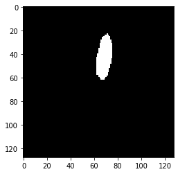

# About

This project is an implementation of unet based architecture to solve the kaggle challenge [Ultrasound Nerve Segmentation](https://www.kaggle.com/c/ultrasound-nerve-segmentation). 

Here is a sample input and it's output from the trained network

| original image  | Corresponding mask for original image  |
| :----------------------------------------------------------: | :----------------------------------------------------------: |
| predicted mask  | Predicted mask after applying threshold  |

